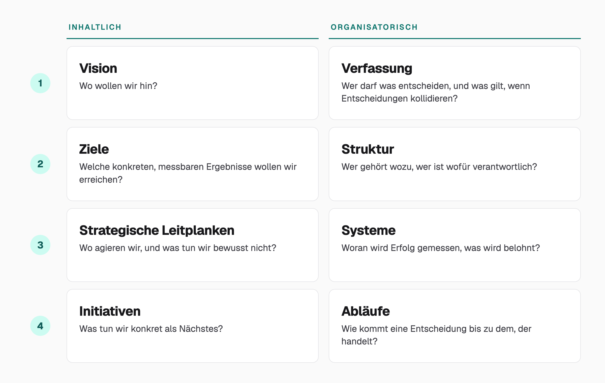

Um zu verstehen, warum KI eine bestehende Dysfunktion in vielen Unternehmen verstärken kann, beginnen wir nicht mit KI, sondern mit der Dysfunktion.
In meiner Laufbahn habe ich in Unternehmen immer wieder erlebt, dass sich Entscheidungen widersprechen, oder Ideen entstehen, die nicht zusammenpassen. Häufig waren sie für sich genommen völlig rational, zumindest aus einer bestimmten Perspektive, und erst im Großen betrachtet widersprüchlich oder sogar schädlich für das Unternehmen. Bewusst falsch hat dabei selten jemand gehandelt, und deshalb fiel der Widerspruch oft erst auf, wenn er Folgen hatte.

Das erste Mal bin ich dem auf einer sehr operativen Ebene begegnet. Ich war Teil eines Teams, das über Wochen mehr geliefert hatte, als geplant war. Mehr fertige Funktionen, mehr abgeschlossene Aufgaben, ein gutes Ergebnis nach jedem Maßstab, der für mich damals Sinn ergeben hat. Eine Projektleiterin begann jedoch zunehmend, diese Mehrleistung zu bremsen.

Das irritierte mich, bis ich später erfuhr, dass sie ein bestimmtes Ergebnis für das bewilligte Budget prognostiziert hatte und dass ihr Bonus an der Genauigkeit ihrer Prognose hing: Sowohl eine deutliche Unter- als auch eine Übererfüllung zählten für sie als Abweichung. Aus ihrer Sicht wurde die gute Geschwindigkeit des Teams damit nicht zum Erfolg, sondern zu einem persönlichen Risiko. Jede Argumentation des Teams dafür, den Fortschritt nicht weiter zu bremsen, weil es für das Unternehmen insgesamt positiv war, lief ins Leere.

Es gibt ein treffendes Zitat des Schriftstellers Upton Sinclair zu diesem Phänomen: „Es ist schwierig, jemandem etwas verständlich zu machen, wenn sein Gehalt davon abhängt, dass er es nicht versteht."[^sinclair] In diesem Fall war es wohl eher ein „nicht verstehen wollen" als „nicht können", denn ihre Ziele machten es für sie rational, eine insgesamt gute Nachricht als individuell schlechte Nachricht zu behandeln.

## Welche Entscheidungen ein Unternehmen prägen

Das persönliche Ziel war in dem obigen Beispiel eine rahmengebende Entscheidung. Innerhalb des ihr gesteckten Rahmens verhielt sich die Projektleiterin völlig rational, auch wenn sie damit objektiv dem Unternehmen schadete. Sie hinderte das Team daran, für die gleichen Investitionen mehr zu liefern, während sie — völlig zu Recht — genau auf die Ziele optimierte, die ihr von außen gegeben waren.

Genau diese rahmengebenden Entscheidungen möchte ich hier genauer betrachten. Dafür lohnt es sich, einen Schritt zurückzutreten und auf das große Ganze zu schauen. Ich veranschauliche mir das (etwas vereinfacht, aber ausreichend) in einem gedanklichen Modell aus zwei Dimensionen mit jeweils vier Ebenen: einer inhaltlichen und einer organisatorischen.

Die inhaltliche Dimension reicht von der Vision, also der Frage, wo das Unternehmen hin will, über Ziele und strategische Leitplanken bis zu den einzelnen Initiativen. Die organisatorische Dimension reicht von der Verfassung, im unternehmensinternen Sinn und nicht als Rechtsbegriff (wer darf was entscheiden, was gilt bei kollidierenden Entscheidungen), über Struktur und Systeme (woran Erfolg gemessen und was belohnt wird) bis zu den Abläufen, über die eine Entscheidung bis zu der Person kommt, die handelt.

Das ist kein hergeleitetes Framework, sondern ein Denkmodell, mit dem ich mir diese Abhängigkeiten sichtbar mache. Einzelne Teile davon finden sich in gängiger Management-Theorie wieder.[^theorie]

## Ein komplexes Geflecht abhängiger Entscheidungen

In jedem dieser acht Felder werden Entscheidungen getroffen: welche Vision das Unternehmen verfolgt, welche Organisationsstruktur es dafür wählt und wie sie explizit aussieht, ob es individuelle Ziele setzt oder Ziele für Teams bzw. Gruppen und ob daran Bonuszahlungen hängen oder nicht usw.

Zwischen all diesen Entscheidungen entsteht ein komplexes Geflecht von Abhängigkeiten, in dem sehr leicht Widersprüche und Lücken entstehen können. Trifft ein Unternehmen beispielsweise eine strategische Entscheidung, was es tun will und was nicht, setzt es dafür möglicherweise Ziele für einzelne Bereiche oder Abteilungen. Dabei kann es passieren, dass unterschiedliche Ziele für die jeweiligen Bereiche unterschiedlich relevant sind, und dass die Struktur somit dafür sorgt, dass nicht mehr überall mit demselben Nachdruck an einem Ziel gearbeitet wird. Schlimmstenfalls wird sogar zwischen den Bereichen bei jeder operativen Entscheidung immer wieder neu verhandelt, welches Ziel nun wichtiger ist.

Eine Entscheidung in einem der acht Felder kann auf diese Weise Konsequenzen und Implikationen für die anderen Felder nach sich ziehen. Die Projektleiterin von oben lässt sich hier einordnen: Ihr Bonus gehörte zu den Systemen, also zu dem Bereich, der definiert, wie Erfolg gemessen wird und was belohnt wird. Dieses System passte im Beispiel nicht zu dem, was das Team tatsächlich leisten sollte.

Um dieses komplexe Geflecht aus untereinander abhängigen Entscheidungen zu benennen, verwende ich den Begriff Entscheidungslogik. Gemeint ist damit nicht der Entscheidungsprozess einer einzelnen Person, sondern die Gesamtheit der Entscheidungen und Rahmenbedingungen in diesen acht Feldern, die festlegen, welche untergeordneten, operativeren Entscheidungen in einem Unternehmen sinnvoll, möglich und erwünscht sind. Sie kann in sich stimmig sein oder Lücken und Widersprüche enthalten, und weil Unternehmen komplexe Systeme sind, machen solche Brüche zwischen den Feldern das ganze System instabil. Sichtbar wird das meistens bei den operativen Entscheidungen und Handlungen, die dann beispielsweise stagnieren, widersprüchlich sind, oder eskaliert werden müssen.

## Ein Beispiel für inkohärente Entscheidungslogik

Veranschaulichen wir das an einem Beispiel auf höherer Flughöhe als die Projektleiterin. Der Fall ist theoretisch und konstruiert, aber nicht völlig abwegig, weil ich in meiner Karriere bereits vergleichbare Konstellationen erlebt habe.

Ein Hersteller professioneller Werkzeuge, der seit Jahrzehnten einzelne Maschinen und Geräte verkauft, führt nun zusätzlich ein Leasingmodell ein: Kund\*innen zahlen nicht mehr für das einzelne Werkzeug, sondern leasen ihren gesamten Werkzeugbestand über eine feste Laufzeit von mehreren Jahren, inklusive regelmäßiger Wartung und Austausch durch Neugeräte nach Ablauf der Laufzeit. Gleichzeitig entwickelt das Unternehmen eine digitale Lösung, über die Kund\*innen Wartungsintervalle, Verträge und Werkzeugbestand als Self-Service verwalten können, auch für bestehende gekaufte Werkzeuge, was die Verwaltung kostengünstig hält und zugleich dabei helfen soll, Kund\*innen ins Leasingmodell zu konvertieren.

Das strategische Ziel dahinter: Das Unternehmen will sein Risikoprofil verändern. Statt ausschließlich von kurzfristigen Maschinenverkäufen abhängig zu sein, will es einen zusätzlichen, wiederkehrenden Umsatzstrom, langfristige Kundenbindung und zusätzlichen Umsatz durch die Wartungsverpflichtung aufbauen.

Hier handelt es sich somit um ein völlig anderes Geschäftsmodell, das die wirtschaftliche Logik verändert. Beim klassischen Verkauf wird der Umsatz unmittelbar erzielt, während beim Leasing die Maschinen zunächst vorfinanziert und die Einnahmen über die Vertragslaufzeit realisiert werden.

Besonders für die Vertriebsorganisation stellt sich das als Herausforderung heraus: Im klassischen Geschäft verkauft der Vertrieb einzelne Maschinen an die Ansprechpartner\*innen, mit denen er über Jahre Beziehungen aufgebaut hat. Im Leasinggeschäft gibt es größere Auftragsvolumina und langfristige Vertragsbindungen, was die Entscheidungen auf höhere Entscheidungsebenen bei den Kund\*innen verschiebt, eine Klientel, die für die bestehende Vertriebsorganisation völlig neu ist.

Zudem verschwindet das alte Geschäft nicht, der Vertrieb verkauft weiterhin einzelne Maschinen an seine bestehenden Kund\*innen.

Damit existieren zwei Geschäftsmodelle nebeneinander, die unterschiedliche Kund\*innen, unterschiedliche Vertriebslogiken und unterschiedliche wirtschaftliche Anforderungen haben.
Lange erlernte Prinzipien, etablierte und lange gepflegte Kundenbeziehungen, sowie gelernte Mechanismen im Vertriebsgespräch sind für das neue Modell nicht mehr gültig.

Daraus kann bei den handelnden Personen auch ein Interessenkonflikt aufkommen, der wie folgt aussehen kann:
Eine Kund\*in möchte eine bestimmte Maschine kurzfristig beschaffen, statt zu warten, bis die Entscheidung über einen Leasingvertrag etliche Ebenen über ihr getroffen wurde. Das Unternehmen ist als Bestandskund\*in bereits in der neuen digitalen Lösung angelegt, und die zuständige Vertriebsmitarbeiter\*in kennt sie seit Jahren und weiß, dass diese Kund\*in genau diese Maschine kaufen möchte. Also entsteht die naheliegende Idee, einfach eine Bestellfunktion in die Plattform einzubauen, über die die Kund\*in die Maschine direkt bestellen kann.

Für den Vertrieb ist das eine vernünftige Lösung. Die Kund\*in bekommt, was sie möchte, der Auftrag kann unmittelbar abgeschlossen werden, die bestehende Kundenbeziehung wird bedient und im klassischen Kerngeschäft wird nach gelernter Logik direkt Geld verdient.

Für das neue Geschäftsmodell ist die Entscheidung dagegen problematisch. Die Plattform, die eigentlich das Leasingmodell skalieren und die langfristige Kundenbeziehung unterstützen soll, wird damit gleichzeitig zum Vertriebskanal für das alte Geschäftsmodell.

Ob dieser Widerspruch tatsächlich auffällt, liegt nun an den Freigabeprozessen im Unternehmen.

Wenn das Softwareteam für die digitale Lösung auch strategische Verantwortung für das Produkt übernimmt, würde es hinterfragen, ob diese Funktion überhaupt zur strategischen Logik des neuen Geschäftsmodells passt. Sieht es sich als reines Umsetzungsteam, wird es die Bestellfunktion bauen, wenn niemand sonst eingreift: Die Anforderung ist klar, technisch machbar und entspricht einem konkreten Kundenwunsch. 

Prozesse liegen nach dem obigen Denkmodell auf der Ebene der Abläufe und sind die letzte Bastion, die solche „falschen" Entscheidungen noch aufhalten kann. Ist sie nicht vorhanden, dann ist auf dem Weg schon viel Zeit und Geld verbraucht worden und es wird erheblich mehr benötigt, um die entstandenen Konsequenzen zu korrigieren. Die Funktion muss wieder entfernt, die Entscheidung begründet und Kund\*innen ggf. beschwichtigt werden. 

Die eigentliche Ursache liegt aber in den höheren Ebenen des Denkmodells: in der fehlenden Konsequenz, mit der die strategische Entscheidung auch Änderungen in der Struktur nach sich zieht, etwa durch einen dedizierten Vertrieb, der auf die neue Situation geschult ist und gar nicht erst in den beschriebenen Interessenkonflikt gerät, erst recht nicht, wenn über die Verfassung klar geregelt ist, dass bei einer Kund\*in immer das neue Leasingmodell zu bevorzugen ist und der Direktverkauf nur noch eine Rückfalloption ist, falls die Kund\*in sonst verloren geht.

## Wie KI die Konsequenzen inkohärenter Entscheidungslogik verschärfen kann

Eigentlich bin ich kein Freund davon, dass sich heute jeder Gedanke zwangsläufig um KI drehen muss. In diesem Fall komme ich aber nicht umhin, diese Technologie in die Gedanken einzubeziehen, weil damit erst deutlich wird, warum eine kohärente Entscheidungslogik gerade jetzt noch wichtiger wird. 
Denn KI verändert nicht die eigentliche Ursache der Inkohärenz, sie hat aber das Potenzial, die Konsequenzen zu katalysieren.
 
Nehmen wir an, die Vertriebsmitarbeiter\*in kann die gewünschte Funktion mithilfe von KI selbst entwickeln (Stichwort: Citizen Developer), weil die Plattform ohnehin schon als Self-Service-Lösung gebaut ist. Sie muss dafür weder ein Entwicklungsteam beauftragen noch auf dessen Priorisierung warten, und damit auch niemanden mehr, der zufällig hätte nachfragen können. Die Bestellfunktion ist am Nachmittag in der Plattform.

Auch ohne KI konnte die Entscheidung zum Problem werden, denn der Bypass zur Strategie war auch so möglich: Wenn das Umsetzungsteam seine Verantwortung rein operativ versteht, wird die Funktion eben gebaut. KI entfernt diesen Umweg aber vollständig und macht den Bypass dadurch für deutlich mehr Menschen und in deutlich mehr Situationen praktisch nutzbar.

Damit steigt die Zahl der Entscheidungen, die auf einer unvollständigen oder widersprüchlichen Entscheidungslogik beruhen können. Und vor allem steigt die Geschwindigkeit, mit der aus einer solchen Entscheidung eine reale Veränderung wird.

Deshalb reicht es nicht, erst an der einzelnen Entscheidung mehr Kontrolle einzubauen. Auch der nachvollziehbare Impuls, der an dieser Stelle kommen mag, "aber KI-Governance", greift aus meiner Sicht zu kurz. Das würde das Problem auf den Blickwinkel der KI beschränken, statt es als grundsätzliche Inkohärenz zu betrachten, die in Organisationen entstehen kann.
Die Frage ist also vielmehr, welche zentralen Entscheidungen den nötigen Rahmen dafür geben, dass dezentrale Entscheidungen sinnvoll und risikoarm getroffen werden.

Denn je leichter Entscheidungen umgesetzt werden können, desto wichtiger wird eine Entscheidungslogik, die diese Entscheidungen bereits vorher in einen kohärenten Rahmen setzt und damit gute Entscheidungen begünstigt.

## Wenn Entscheidungen zum Engpass werden

Der natürliche Reflex, den ich in Bezug auf Menschen in solchen Situationen hingegen oft erlebe, ist: „Wir müssen diese wichtigen operativen Entscheidungen weiter oben in der Hierarchie treffen, damit Klarheit herrscht und keine Fehler passieren." Ich hätte einige Anmerkungen zu den kritischen Annahmen hinter diesem Vorgehen, aber die offensichtliche Kritik im  Kontext des Artikels ist, dass die Entscheider\*innen weiter oben in der Hierarchie damit zum Engpass werden und Entscheidungen, alleine durch den Weg, unweigerlich langsamer werden.

Das widerspricht jedoch einem der primären Ziele, die sich die meisten Unternehmen durch den Einsatz von KI versprechen: mehr Geschwindigkeit.

Autonome Agenten werden erst dann ihrem Namen gerecht, wenn sie auch in der Lage sind, autonome Entscheidungen zu treffen und dabei nicht jedes Mal auf Menschen zu warten, die ihrerseits fragend in Richtung ihrer Vorgesetzten schauen. 

Erstaunlich finde ich dabei, dass in der Diskussion um KI und autonome Systeme heute schon viel über Entscheidungslogik diskutiert wird. Neudeutsch nennt sich das im Zusammenhang mit KI dann „Harness".[^harness] Ein wesentlicher Teil davon ist nach meiner Lesart, Agenten und LLMs einen Entscheidungsrahmen zu geben, der bestimmte „schlechte" Entscheidungen gar nicht erst möglich oder zumindest unwahrscheinlicher macht. Zumindest in meiner Filterblase kommen immer weniger Menschen auf die Idee, ihre Agenten durch Kontrolle und zentralisierte Entscheidungen im Zaum zu halten. Das hat nichts mit einer KI-freundlichen Einstellung zu tun, sondern ist purer Pragmatismus. Kontrolle und zentralisierte Entscheidungen verschieben den Engpass zu genau diesen Punkten und bremsen die Effizienz. Also suchen alle fleißig (und völlig zu Recht) den Fehler bei sich und ihrem Entscheidungssystem. Etwas drastischer ausgedrückt: Niemand feuert sein LLM, weil es schlechte Entscheidungen trifft, sondern arbeitet daran, einen Rahmen zu setzen, mit dem Entscheidungen „richtiger" werden.

Warum legen wir diesen Maßstab so selten bei menschlichen „Agenten" und „Systemen" an? Offen gesagt, weiß ich das nicht, aber ich habe eine Vermutung. Zum ersten Mal werden träge Entscheidungsprozesse so richtig schmerzhaft sichtbar, weil wir in einigen Dingen so dramatische potenzielle Effizienzsteigerungen erreicht haben, dass sich vor der bremsenden Wirkung träger Entscheidungen nicht mehr die Augen verschließen lassen. Außerdem ist uns vielleicht bewusst oder unbewusst klar, dass wir versuchen, ein System zu kontrollieren, das auf unverhältnismäßig viel mehr Wissen unmittelbar zugreifen kann. Zu glauben, es besser zu können, wirkt dann sehr schnell wie Selbstüberschätzung. Bei Menschen scheint es Führungskräften zum einen leichter zu fallen, anzunehmen, dass sie einzelne operative Entscheidungen besser treffen als ihre Mitarbeiter\*innen, und zum anderen zu übersehen, dass sie damit selbst zum Engpass werden.

## Erst die Entscheidungslogik, dann KI

Damit landen wir beim titelgebenden Punkt: Wer Lücken und Widersprüche in seiner Entscheidungslogik nicht schließt, zahlt für den Einsatz von KI so oder so drauf. Zentralisiert eine Organisation Entscheidungen, um Schaden zu minimieren, bremst sie genau die Geschwindigkeit aus, für die KI überhaupt eingesetzt wird. Lässt sie die Entscheidungen laufen, zahlt sie hinterher mit aufwändigen Korrekturen und dem entstandenen Schaden, bis ein Fehler auffällt. Wer seine Mitarbeiter\*innen und Teams also ausbremst oder erst hinterher aufräumt, statt vorher die Lücken und Widersprüche in der Entscheidungslogik zu schließen, hat sich für den Einsatz von KI selbst einen Bremsklotz aufgelegt.

Drei Fragen dazu:

Bei welcher „schlechten" Entscheidung der letzten Monate findet man bei genauem Hinsehen Lücken oder Widersprüche in der Entscheidungslogik oder im Wissen darüber bei den handelnden Personen, statt den Fehler bei den Personen zu suchen?

Wie viel Zeit und Energie stecken die Führungskräfte des Unternehmens in einen kohärenten Entscheidungsrahmen, der Mitarbeiter\*innen die nötige Orientierung und Sicherheit gibt, selbst gute Entscheidungen zu treffen?

Wie viel Zeit stecken diese Führungskräfte im Vergleich dazu in die Korrektur oder Kontrolle von Entscheidungen, oder in Entscheidungen, die sie für ihre Mitarbeiter\*innen treffen?

[^sinclair]: Upton Sinclair, „I, Candidate for Governor: And How I Got Licked“ (1935), Neuauflage University of California Press, 1994, S. 109: „It is difficult to get a man to understand something, when his salary depends upon his not understanding it!“ Wird gelegentlich fälschlich H. L. Mencken zugeschrieben, die Fundstelle bei Sinclair selbst ist jedoch belegt. https://quoteinvestigator.com/2017/11/30/salary/

[^theorie]: Die Aufteilung in eine inhaltliche und eine organisatorische Dimension mit je vier Ebenen ist an mehrere Ansätze der Managementlehre angelehnt, unter anderem: Jay Galbraith, Star Model (Strategy, Structure, Processes, Rewards, People), als Vorbild für die organisatorische Seite; Alfred D. Chandler, „Strategy and Structure" (1962), mit der Grundthese, dass Strategie und Struktur getrennte, aber verknüpfte Größen sind; das McKinsey-7S-Modell (Tom Peters und Robert Waterman, „In Search of Excellence", 1982), sieben Dimensionen, die zueinander kohärent sein müssen. Vgl. St. Galler Management-Modell.

[^harness]: Justin Young u. a., Anthropic Engineering, „Effective harnesses for long-running agents", 26.11.2025: Der Beitrag zeigt, wie speziell aufgebaute Anweisungen, eine Funktionsliste und verpflichtende Tests steuern, wie ein Agent über viele Sitzungen hinweg arbeitet. https://www.anthropic.com/engineering/effective-harnesses-for-long-running-agents
