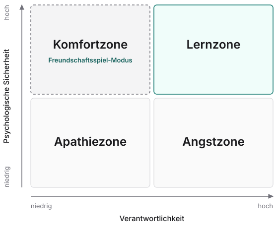

„Nichts zu verlieren haben“ gilt im Deutschen als Einladung zum Wagnis: Wer nichts zu verlieren hat, soll freier spielen und mutiger entscheiden. Meine Beobachtung der letzten Jahre geht in die andere Richtung. Wo in einem Team oder einer Organisation wirklich nicht genug auf dem Spiel steht, wird nicht mutiger gearbeitet, sondern beliebiger, und zwar auch von Menschen, die genau wissen, was sie erreichen wollen. Ich nenne das für mich den Freundschaftsspiel-Modus: Man spielt weiter, mit Einsatz und gutem Willen sogar, aber unbewusst so, wie man in einem Testspiel spielt, in dem man nach Sieg oder Niederlage keine Punkte gewinnt oder verliert und weder im Turnier weiterkommt noch ausscheidet.

Rückblickend habe ich das zum ersten Mal früh in meiner Laufbahn als Berater wahrgenommen. In einem großen Konzern habe ich erlebt, wie Meeting um Meeting einberufen wurde, in großer Besetzung, bis hin zu mehreren Abteilungsleiter\*innen, nur um den Namen für ein Projekt zu finden. Wortspiele wurden abgewogen, Akronyme durchdekliniert, und jedes Mal hatte man den Eindruck, es ginge gerade um etwas ganz Wichtiges. Ich habe damals schon innerlich den Kopf über die horrenden Kosten geschüttelt, die mit vollen Händen ausgegeben wurden, während ich an anderer Stelle vergeblich um ein paar Gigabyte mehr Arbeitsspeicher gekämpft habe, weil das einem Prozess widersprach. Die damit ersparte Wartezeit beim Hochfahren meiner lokalen Entwicklungsumgebung hätte die Kosten dafür innerhalb einer Woche amortisiert.

Dieses Beispiel hat sich bei mir mit mehr als einem Jahrzehnt Abstand als Paradebeispiel für eine Umgebung eingebrannt, in der augenscheinlich nicht mehr wirtschaftlich gehandelt wurde.

## Rahmenbedingung statt Charakterfrage

In den späteren Jahren habe ich in eigenen Teams zum ersten Mal richtig beobachtet, dass selbst Menschen, die hochmotiviert sind und etwas erreichen wollen, ungewollt Zeit verschwenden können. Ein Team hatte sich beispielsweise ein internes Werkzeug überlegt, um Rückmeldungen strukturierter zu erfassen, und noch bevor klar war, welche Relevanz es zu diesem Zeitpunkt für den wirtschaftlichen Erfolg hatte, bekam es einen liebevoll ausgetüftelten Namen samt Akronym. Als ich davon gehört habe, dachte ich: „Jetzt sind wir auch an diesem Punkt angekommen.“ In anderen Fällen begegnete mir eine Tendenz zur Basisdemokratie, die ich aus früheren Erfahrungen schon kannte, und mein Unwort dazu, das mich seit Jahren verfolgt, lautet „abholen“. Bis auch die letzte Person „abgeholt“ (also überzeugt) war, wurden manchmal mehrere Runden dazu gedreht, welchen Weg man bei einem bestimmten Thema einschlägt. Oder es wurde eine Entscheidung wieder und wieder mit Nutzer\*innen überprüft, anstatt einfach zu bauen, obwohl das Signal aus den Rückmeldungen viel zu uneindeutig war, um daraus eine bessere Entscheidung abzuleiten. Und immer wieder wurde an Produkten und Prozessen gefeilt, für die noch gar nicht bewiesen war, dass sich mit ihnen ein tragfähiges Geschäftsmodell ergibt.

Ich betrachte dieses Verhalten inzwischen als Symptom, nicht als Charakter- oder Haltungsfrage. Ich bin überzeugt, dass so etwas vor allem dann passiert, wenn es nicht wirklich etwas zu verlieren gibt. Es hat aus meiner Sicht hingegen wenig bis nichts damit zu tun, dass die Beteiligten nicht verstanden hätten, dass Ergebnisse erzielt und Geld verdient werden müssen. Sie handeln in voller Überzeugung, etwas zu einem Ziel beizutragen. Wenn Misserfolg jedoch keine Konsequenz hat, weil beispielsweise über lange Zeit trotzdem weiter Budget bereitgestellt wird, dann bedeutet Verlieren nichts mehr. In diesem Vakuum optimieren alle unbewusst auf das, was ihnen für den zukünftigen Erfolg wichtig erscheint: handwerkliche Qualität, herausragendes Design, exzellente Prozesse oder eben schicke Namen (weil man damit „die Leute abholt“). Wenn die diffuse Aussicht auf irgendwann eintretenden Erfolg schwerer wiegt als die Sorge vor einer bevorstehenden Niederlage, dann tritt ihre Vermeidung als gemeinsames, verbindendes Ziel in den Hintergrund.

Für die beschriebenen Symptome gibt es sogar einen Namen, das sogenannte Bikeshedding: Wie viel Zeit ein Gremium auf einen Tagesordnungspunkt verwendet, hängt oft eher davon ab, wie leicht jeder mitreden kann, als davon, wie viel Geld dabei tatsächlich auf dem Spiel steht.[^bikeshedding] Das beschreibt, warum zwanzig Leute eine Stunde über ein Akronym reden können. Warum es so weit kommt, dass solche Tagesordnungspunkte überhaupt auf der Agenda stehen, erklärt der Begriff nicht.

## Der Freundschaftsspiel-Modus, und woher er kommt

Ein passendes Bild für dieses Phänomen kommt für mich aus dem Fußball. In einem Freundschaftsspiel geht kaum jemand mit letzter Härte in den Zweikampf, weil sich niemand für ein Spiel verletzen will, das am Ende nicht entscheidend ist. Im Halbfinale eines Turniers ist das anders: Wer verliert, scheidet aus.

Übertragen auf die Arbeit ist der Zweikampf für mich zum Beispiel die hitzige, unangenehme Diskussion, die man mit Kolleg\*innen führt, weil man überzeugt ist, dass man sich gerade mit Themen beschäftigt, die für Erfolg oder drohende Niederlage nicht entscheidend sind. Im Freundschaftsspiel-Modus führt man diese Diskussion eher nicht. Dabei kritisiere ich nicht das einzelne Testspiel. Trainer\*innen setzen es bewusst an, um Dinge auszuprobieren, die sie sich im Pokal nie erlauben würden, und sich dort zurückzunehmen ist vernünftig, denn wer sich im Testspiel das Kreuzband reißt, hat einen hohen Preis für nichts bezahlt. Kritisch wird es erst, wenn eine ganze Saison nur noch aus Testspielen besteht.

Woher dieser Modus kommt, habe ich selbst vielfach erlebt: in Teams und Organisationen, in denen Ziele für den Erfolg gesetzt wurden, bei denen aber klar war, dass auch bei verfehlten Zielen das Investment weiter fließen würde. Es gab dann meistens gute und richtige Erklärungen für das Verfehlen, man hatte ja trotzdem merklichen Fortschritt erreicht. Generell habe ich oft die Neigung erlebt, Ziele im Rückblick zu relativieren. Aus meiner Sicht war das in fast allen Fällen auf eine fehlende Konsequenz für das Verlieren zurückzuführen, die wirklich Bedeutung gehabt hätte. Eine solche Konsequenz wäre zum Beispiel gewesen, eine Unternehmung oder ein Produkt nach einem definierten Zeitraum zu beenden, wenn bis dahin kein minimales Ergebnis erzielt wurde, das eine weitere Finanzierung gerechtfertigt hätte.

Es gibt dazu eine Studie des Wirtschaftswissenschaftlers János Kornai, in der er ein verwandtes Phänomen beschreibt: Je sicherer ein Betrieb damit rechnen kann, dass eine andere Stelle, typischerweise der Staat, seine Mehrausgaben deckt, desto weicher wird seine Budgetbeschränkung, desto schwächer reagiert er auf Preise und desto geringer wird seine Effizienz.[^kornai] Kornai selbst hat das an Staats- und Mischwirtschaften beschrieben. Dass es auch für Initiativen im Konzern gilt, ist meine eigene Analogie, aber der Kern überzeugt mich: Wer weiß, dass die Finanzierung so oder so weiterläuft, hat weniger Zwang, sich am Markt zu beweisen.

Ein Bild, das mir hilft, diesen Modus zu erkennen, stammt von Amy Edmondson, die für den Begriff der psychologischen Sicherheit bekannt ist. Sie stellt psychologische Sicherheit und Verantwortlichkeit, also die Erwartung, hohe Standards zu halten und anspruchsvolle Ziele zu verfolgen, als zwei Achsen einer Vierfeldertafel dar, die sich unabhängig voneinander kombinieren lassen.[^edmondson] Daraus ergeben sich vier Zonen. Hohe Sicherheit bei niedriger Verantwortlichkeit ist die Komfortzone, für mich eine gute Beschreibung des Freundschaftsspiel-Modus. Hohe Verantwortlichkeit bei niedriger Sicherheit ist die Angstzone, beides niedrig die Apathiezone und beides hoch die Lernzone. Mich beschäftigt daran die Frage, wie sich mehr Verantwortlichkeit herstellen lässt, ohne die psychologische Sicherheit aufzugeben.

*Sinngemäß nach Edmondson, eigene Darstellung. Die Einordnung des Freundschaftsspiel-Modus stammt vom Autor.*

## Ein Umfeld schaffen, in dem Verlieren eine Rolle spielt

Für mich zählen hier zwei Erkenntnisse. Erstens: Den Freundschaftsspiel-Modus gibt es, und zwar gerade auch in Teams mit engagierten, motivierten Menschen. Zweitens: Er ist häufig keine Frage der Menschen, sondern des Rahmens, genauer der Frage, ob Verlieren eine Konsequenz hat. Dagegen gibt es aus meiner Sicht viele Ansatzpunkte, und die meisten sind bekannt und üblich. Sie wirken allerdings nur, wenn die Konsequenz echt ist: Sie folgt logisch aus dem Vorhaben selbst, und den Beteiligten ist vorab klar, wo die Hürde liegt. Ein konstruierter Rahmen funktioniert nicht, eine Frist ohne Folge oder ein Ziel, dessen Verfehlen nichts ändert, zählt nicht. Als Kriterium nutze ich die Frage: Geht etwas von Bedeutung verloren, zum Beispiel ein Job oder eine Chance? Gemeint ist das Vorhaben als Ganzes: Einzelne Experimente dürfen folgenlos scheitern, sonst wagt niemand etwas. Scheitern oder Erfolg des gesamten Vorhabens muss aber Konsequenzen haben.

Der wohl üblichste Ansatz sind Ziele mit finanziellen Anreizen, etwa Boni. Das ist aus meiner Sicht allerdings ein konstruierter Rahmen und eher ein Anreiz als eine Konsequenz: Er wird von außen auf das Vorhaben gesetzt und folgt nicht aus ihm. Wer das Ziel verfehlt, verliert im schlimmsten Fall einen Teil des Bonus, das Vorhaben läuft trotzdem weiter. Individuelle Ziele sind aus meiner Sicht heikel, Teamziele meist die bessere Wahl. Selbst prominente Vertreter des Zielsystems OKR raten davon ab, Ergebnisse an Boni zu koppeln (Ausnahme: Vertriebsquoten), weil das System sonst eher auf den Bonus hin ausgereizt wird.[^okr]

Der härtere Ansatz ist ein klarer Rahmen mit Folgen, die sich aus dem Vorhaben selbst ergeben: Wird eine Abteilung aufgebaut, um ein neues Geschäftsmodell zu entwickeln, wird sie geschlossen, wenn es nicht wirtschaftlich ist, und damit endet auch das Beschäftigungsverhältnis der handelnden Personen. Konkret heißt das eine Finanzierung für einen definierten Zeitraum von mehreren Jahren, danach muss sich das Vorhaben selbst tragen oder eine Folgefinanzierung gewinnen, sonst endet es. In Startups ist das üblich, dort finanziert man sich von Runde zu Runde, und Menschen entscheiden sich bewusst dafür. Aus meiner Sicht entsteht Sicherheit dadurch, dass klar ist, was passiert: Budget und Hürde stehen von Beginn an fest, und die Hürde lässt sich nur mit echtem Fortschritt erreichen. Kritisch wird es, wenn die Frist diffus bleibt oder schon eine einzelne falsche Entscheidung den Job kosten kann. Ein echtes Spiel braucht etwas, das man verlieren kann, aber nicht die Angst, alles zu verlieren, denn die lässt einen eher vorsichtig und konventionell entscheiden, gerade dort, wo Mut gefragt wäre.

Der ermutigendere Ansatz ist eine Chance, die wieder verloren werden kann. Am häufigsten ist das die Aussicht, sich für eine Beförderung oder eine größere Aufgabe zu empfehlen. Man verliert dann zwar nicht den Job, aber man hat schon vom süßen Wein der Chance gekostet. Größere Schritte sind eine Ausgründung, bei der aus einer Linien-Rolle im Unternehmen die Geschäftsführung eines Tochterunternehmens werden kann, oder eine Beteiligung der Mitarbeiter\*innen am wirtschaftlichen Erfolg der Initiative. Beides ergibt in sich Sinn: Gelingt das Geschäftsmodell, gibt es einen Anteil am Erfolg, und scheitert es, verliert man diese Aussicht, kehrt aber in die Linie zurück. Ich habe schon Ausgründungen erlebt, in denen diese Chance für einen echten Pflichtspiel-Modus gesorgt hat.

Ein entscheidender Punkt ist dabei vielleicht weniger offensichtlich und üblich: wer die Konsequenzen und die Hürden festlegt und für ihre Einhaltung sorgt. Aus meiner Sicht braucht es dafür jemanden, der selbst nicht davon abhängt. Eine Hürde wirkt nur, wenn alle glauben, dass sie im Ernstfall auch gilt. Wer zum Beispiel mit dem eigenen Job am Vorhaben hängt, setzt die Konsequenzen am Ende vermutlich nicht in voller Härte durch, wählt sie schon vorher milder und ist versucht, die Hürde nachträglich zu verschieben. Idealerweise ist das jemand, der das Vorhaben finanziert, aber dennoch sachlich bewertet. Im Mittelstand ist das in der Regel die Rolle der Geschäftsführung.

## Konkrete Fragen für die Zukunft

Zwei Fragen nehme ich mir mit, die ich künftig stelle, wenn ich den Freundschaftsspiel-Modus in Teams und Organisationen beobachte:

- Hat das Fehlschlagen des gemeinsamen Vorhabens eine bedeutsame Konsequenz, oder ist es eigentlich folgenlos?
- Wenn es folgenlos ist, welchen Ansatz gäbe es, damit die Konsequenz Bedeutung bekommt?

In meiner Filterblase höre ich zuletzt immer häufiger, dass Eigenverantwortung und Selbstorganisation scheinbar nicht funktionieren. In meiner Wahrnehmung ist der Freundschaftsspiel-Modus dafür eine häufige Ursache und einer der größten Gegner dieser beiden Prinzipien. Meine These dazu: Ein Team kann besser eigenverantwortlich spielen, wenn es etwas zu verlieren gibt.

## Wesentliche Erkenntnisse

### 1 — Den Freundschaftsspiel-Modus gibt es auch in motivierten Teams

Er zeigt sich an Ersatzhandlungen wie Namensfindung, endloser Abstimmung und dem nächsten Feinschliff, und er betrifft gerade Menschen, die etwas erreichen wollen. Ein Bild dafür ist die Komfortzone bei Edmondson: hohe psychologische Sicherheit bei niedriger Verantwortlichkeit. Wer ihn erkennt, sucht nicht mehr nach mangelnder Motivation.

### 2 — Das Vorhaben muss scheitern können, das einzelne Experiment nicht

Einzelne Experimente dürfen folgenlos scheitern, sonst wagt niemand etwas. Für das Vorhaben als Ganzes hilft die Frage, ob etwas von Bedeutung verloren geht, zum Beispiel ein Job oder eine Chance. Die Konsequenz muss dabei aus dem Vorhaben selbst folgen und vorab bekannt sein: Eine Abteilung für ein neues Geschäftsmodell endet, wenn es sich nicht trägt. Ein Bonus ist dagegen eher ein Anreiz als eine Konsequenz.

### 3 — Die Hürde setzt besser, wer nicht selbst am Vorhaben hängt

Eine Hürde wirkt nur, wenn alle glauben, dass sie im Ernstfall gilt. Wer mit dem eigenen Job am Vorhaben hängt, wählt die Konsequenzen eher milder oder verschiebt die Hürde nachträglich. Ideal ist jemand, der das Vorhaben finanziert und dennoch sachlich bewertet, im Mittelstand in der Regel die Geschäftsführung.

[^bikeshedding]: C. Northcote Parkinson, „Parkinson's Law“ (1957), zusammengefasst im Wikipedia-Artikel „Law of triviality“: Satirische Beschreibung eines Ausschusses, der über einen sehr teuren Reaktor kurz und über einen billigen Fahrradschuppen lange berät, weil jeder beim Schuppen mitreden kann. Hier nur als Name für das Symptom verwendet, nicht als empirischer Befund und nicht als Erklärung seiner Ursache. https://en.wikipedia.org/wiki/Law_of_triviality

[^kornai]: János Kornai, „The Soft Budget Constraint“, Kyklos 39(1), 1986, S. 3–5, 9–10: Die Budgetbeschränkung wird weich, wenn Entscheider mit hoher subjektiver Wahrscheinlichkeit erwarten, dass Mehrausgaben von einer anderen Institution gedeckt werden, typischerweise vom Staat; Folgen sind sinkende Preisreagibilität und geringere Effizienz. Kornai versteht den Begriff ausdrücklich als Metapher (S. 9) und belegt ihn an sozialistischen Volkswirtschaften (Ungarn, Jugoslawien, China) und Mischwirtschaften; das Konzept selbst stammt aus seinen früheren Arbeiten (1979/1980). Konzerne mit Quersubventionierung nennen Kornai, Maskin und Roland als einen Rettungsfall in „Understanding the Soft Budget Constraint“, Journal of Economic Literature 41(4), 2003, S. 1095–1136 (Motiv 2, Seite 9 des Autorenmanuskripts), ohne ihn zu untersuchen; die Übertragung auf konzerninterne Initiativen ist eine eigene Analogie, keine Aussage der Autoren. https://www.kornai-janos.hu/media/konyvek_cikkek/w20825/Kornai1986_The_Soft_budget_Constraint_-_Kyklos.pdf und Autorenmanuskript: https://eml.berkeley.edu/~groland/pubs/understanding.pdf

[^edmondson]: Amy Edmondson, „Teaming: How Organizations Learn, Innovate, and Compete in the Knowledge Economy“, Wiley 2012, nach der Wiedergabe bei Latessa u. a., „Psychological safety and accountability in longitudinal integrated clerkships: a dual institution qualitative study“, BMC Medical Education 23:760, 2023 (mit Edmondson als Koautorin): Psychologische Sicherheit und Verantwortlichkeit (accountability, definiert als die Erwartung, hohe Standards einzuhalten und anspruchsvolle Ziele zu verfolgen) bilden die Achsen einer Vier-Felder-Tafel mit Lernzone (beides hoch), Komfortzone (Sicherheit hoch, Verantwortlichkeit niedrig), Angstzone (Sicherheit niedrig, Verantwortlichkeit hoch) und Apathiezone (beides niedrig). Die Formulierung folgt der Wiedergabe bei Latessa u. a.; das Original „Teaming“ lag nicht im Volltext vor. Das Schema ist ein Denkmodell, kein empirisch getesteter Befund. Die Grafik ist eine eigene Darstellung. Zum Begriff der psychologischen Sicherheit: Edmondson, „Psychological Safety and Learning Behavior in Work Teams“, Administrative Science Quarterly 44(2), 1999, S. 350–383. https://pmc.ncbi.nlm.nih.gov/articles/PMC10571297/

[^okr]: John Doerr, Interview „John Doerr on OKRs: The Original Interview“ (Betterworks), Datum auf der Seite nicht angegeben: „Don't tie the OKR goals to bonus payments, except for sales quotas. We want to build a bold, risk-taking culture.“ Laszlo Bock (ehemaliger Personalchef bei Google) im Interview „Divorce Compensation from OKRs“, What Matters: OKR sollten „totally divorced from compensation“ sein; Google habe einmal OKR direkt an Vergütung gekoppelt, worauf Mitarbeitende das System zum Erreichen der Boni „gamed“ hätten. Einschränkend: Die Aussage zu „Measure What Matters“ (2018) stammt aus Sekundärquellen, das Buch selbst lag nicht im Volltext vor. Doerr macht eine Ausnahme für Vertriebsquoten, Googles re:Work-Leitfaden erwähnt Boni gar nicht, und es handelt sich um Empfehlungen, keine Befunde zur tatsächlichen Verbreitung: Einzelne Anbieter wie Betterworks befürworten sogar eine bedingte Kopplung. https://www.betterworks.com/magazine/keys-okr-success-qa-john-doerr und https://www.whatmatters.com/articles/laszlo-bock-divorce-compensation-from-okrs
